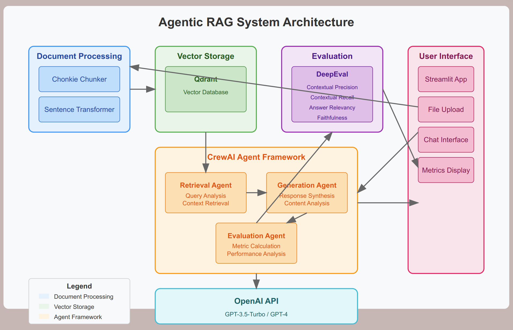

# Agentic RAG Chatbot

This repository contains an implementation of an agentic Retrieval-Augmented Generation (RAG) chatbot using CrewAI for agent orchestration, Chonkie for semantic document chunking, and DeepEval for LLM response evaluation.


[qaai.webm](https://github.com/user-attachments/assets/520fe4e7-3a86-44f9-be36-b8361d047a0a)



## Project Structure

```
project/
├── README.md
├── requirements.txt
├── config.py
├── main.py
├── data/
│   └── sample_docs/
│       └── place_your_documents_here.txt
├── src/
│   ├── agents/
│   │   ├── __init__.py
│   │   ├── retrieval_agent.py
│   │   ├── generation_agent.py
│   │   └── evaluation_agent.py
│   ├── chunking/
│   │   ├── __init__.py
│   │   └── chunker.py
│   ├── embedding/
│   │   ├── __init__.py
│   │   └── embedder.py
│   ├── evaluation/
│   │   ├── __init__.py
│   │   └── evaluator.py
│   ├── retrieval/
│   │   ├── __init__.py
│   │   └── vector_store.py
│   ├── utils/
│   │   ├── __init__.py
│   │   └── helpers.py
│   └── crew/
│       ├── __init__.py
│       └── agentic_rag_crew.py
```
    

## Installation

```bash
# Clone the repository
gh repo clone GouthamChandrappa/RAG_AGENTIC_CHATBOT
cd RAG_AGENTIC_CHATBOT

# Install dependencies
pip install -r requirements.txt

# Set up environment variables
export OPENAI_API_KEY=your_openai_api_key

#Make sure Qdrant is running (if using Docker):
docker run -d -p 6333:6333 qdrant/qdrant

```

## Usage

### Index Documents

```bash
#create a data folder in the root directory (provided command for linux based systems)
touch data/sample_docs/YOUR_DOCUMENT.pdf 

# Index a single document
python main.py --index data/sample_docs/document.pdf

# Index a directory of documents
python main.py --index data/sample_docs/

# OR you can directly run and use this AGENTIC RAG CHAT ASSISTANT, use the following command:
streamlit run app.py
```


### Process Queries indivually on the system:

```bash
# Process a single query
python main.py --query "YOUR_QUERY"

# Run in interactive mode
python main.py --interactive

# Generate evaluation report
python main.py --eval --output results.json
```

